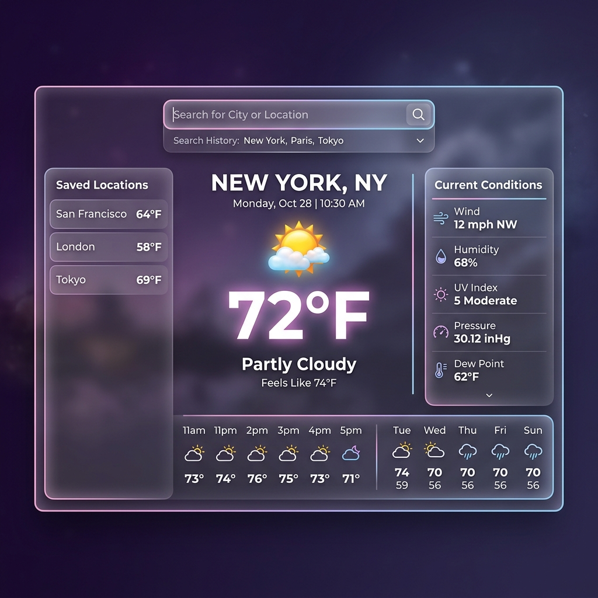
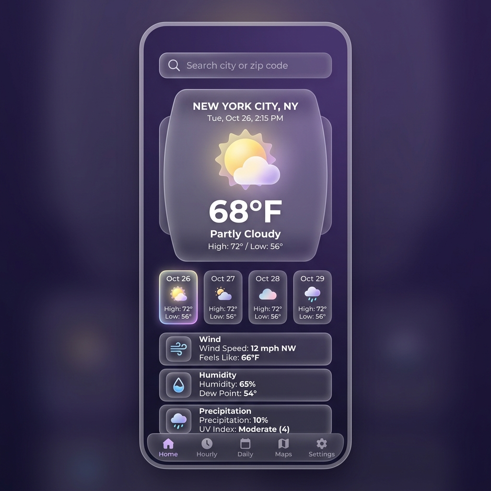

# 🌤️ Weather App

Bienvenido a **Weather App**. Este proyecto es un ejercicio de práctica creado principalmente para aprender a consumir y manejar **APIs RESTful** de forma asíncrona mediante JavaScript moderno (`async/await`). La fuente de datos utilizada es la API de Visual Crossing Weather.

El diseño está construido desde cero utilizando HTML semántico y CSS puro, aplicando un estilo visual moderno conocido como **Glassmorphism**, enfocado en ofrecer una experiencia de usuario limpia, estética y muy fluida. 

## 💻 Vistas de la Aplicación

### Versión de Escritorio (Desktop)

### Versión Móvil (Mobile)

## 🚀 Características Principales

- **Consumo de API:** Integración de datos meteorológicos reales usando `fetch` y promesas.
- **Búsqueda Dinámica:** Permite buscar cualquier ciudad del mundo y obtener datos de clima, viento, humedad y visibilidad al instante.
- **Glassmorphism UI:** Interfaz moderna con paneles de cristal, transparencias, desenfoques (`backdrop-filter`) y micro-animaciones.
- **Iconos Profesionales:** Integración directa de [Lucide Icons](https://lucide.dev/) (iconos SVG) que cambian automáticamente según el estado del clima reportado por la API.
- **Totalmente Responsivo:** Diseñado con CSS Grid y Flexbox para que se vea increíble tanto en teléfonos móviles como en monitores grandes.
- **Fecha y Hora:** Procesamiento de fecha en el cliente usando JavaScript (`new Date()`) con el formato internacional estandarizado.

## 🛠️ Tecnologías Usadas
- **HTML5** 
- **CSS3** (Animaciones, Variables, Flexbox, Grid)
- **JavaScript (Vanilla JS ES6+)**
- **Visual Crossing Weather API**

---
*Creado por Ignacio como ejercicio de práctica y portafolio.*